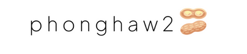
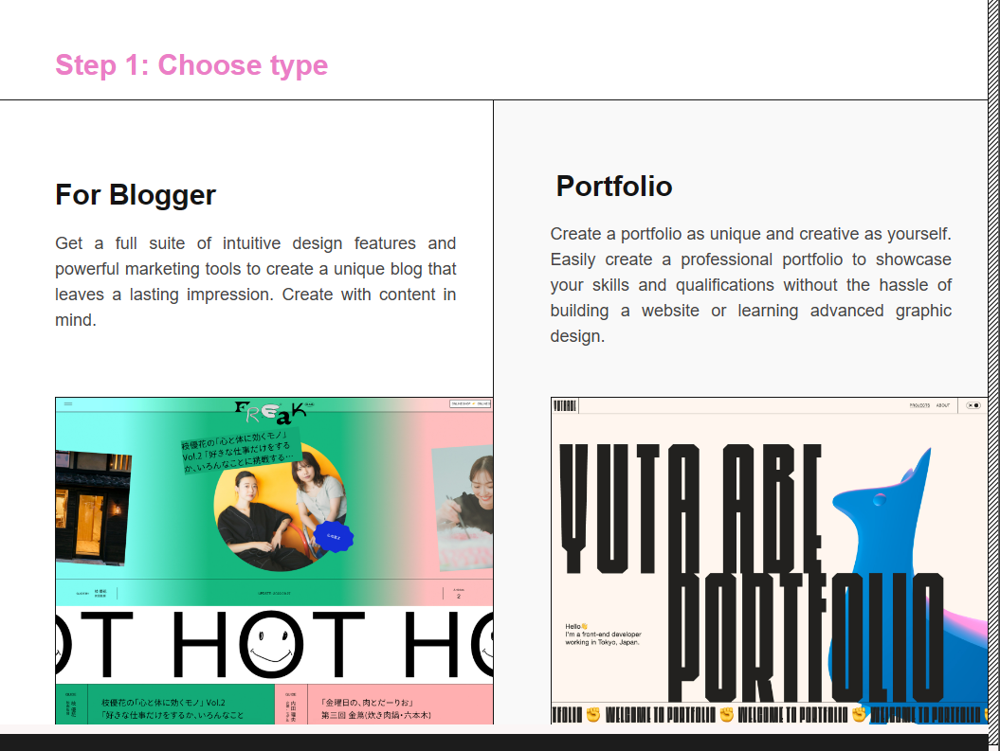

<h1 align="center"> Pmaker </h1>  

  

  Start your blog/portfolio, your way.

  

  

## Introduction

Create and grow your developer blog or portfolio effortlessly with Pmaker. 

**Available for both iOS and Android.**

  

## Features

A few of the things you can do with Pmaker:

* Create your blog / portfolio.
* Join the conversation: discuss and debate with your favorite writers.
* Writing.
* Update your portfolio.

  

## Contributors

This project follows the [all-contributors](https://github.com/kentcdodds/all-contributors) specification and is brought to you by these [awesome contributors](./CONTRIBUTORS.md).

## Build Process

- Follow the [React Native Guide](https://facebook.github.io/react-native/docs/getting-started.html) for getting started building a project with native code. **A Mac is required if you wish to develop for iOS.**
- Clone or download the repo
- `yarn` to install dependencies
- `yarn run link` to link react-native dependencies
- `yarn start:ios` to start the packager and run the app in the iOS simulator (`yarn start:ios:logger` will boot the application with [redux-logger](<https://github.com/evgenyrodionov/redux-logger>))
- `yarn start:android` to start the packager and run the app in the the Android device/emulator (`yarn start:android:logger` will boot the application with [redux-logger](https://github.com/evgenyrodionov/redux-logger))

Please take a look at the [contributing guidelines](./CONTRIBUTING.md) for a detailed process on how to build your application as well as troubleshooting information.

**Development Keys**: The `CLIENT_ID` and `CLIENT_SECRET` in `api/index.js` are for development purposes and do not represent the actual application keys. Feel free to use them or use a new set of keys by creating an [OAuth application](https://github.com/settings/applications/new) of your own. Set the "Authorization callback URL" to `gitpoint://welcome`.

## Backers 

Thank you to all our backers! 🙏 [[Become a backer](https://opencollective.com/git-point#backer)]

## Sponsors 

Support this project by becoming a sponsor. Your logo will show up here with a link to your website. [[Become a sponsor](https://opencollective.com/git-point#sponsor)]

## Acknowledgments

Thanks to [JetBrains](https://www.jetbrains.com) for supporting us with a [free Open Source License](https://www.jetbrains.com/buy/opensource).
